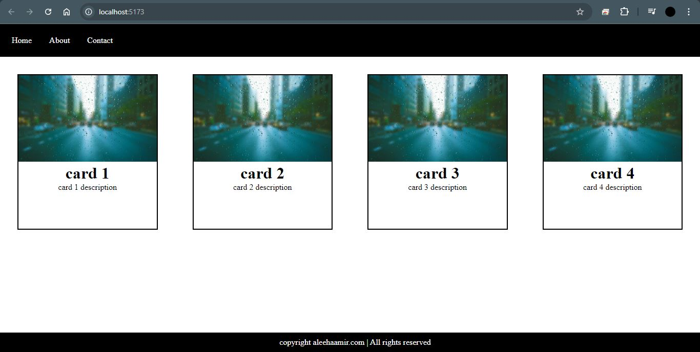

<!DOCTYPE html>
<html lang="en">
<head>
    <meta charset="UTF-8">
    <meta name="viewport" content="width=device-width, initial-scale=1.0">
    <meta http-equiv="X-UA-Compatible" content="IE=edge">

   
</head>
<body>
<ul>
<li>Class name instead of class in JSX</li>
<li>Create a navigation bar</li>
<li>Center a div using CSS</li>
<li>Styling with JSX and create omponents in React</li>
<li>Using props and styling in React components</li>
<li>Using props to pass data in React components.</li>
<li>Pass data as props and receive in another component</li>
</ul>
    

</body>
</html>
